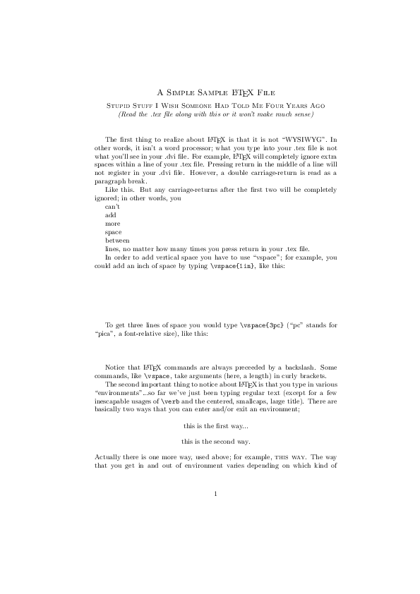

# Reproducible Research through LaTeX and Rmarkdown

이 저장소는 재현가능한 연구에 대한 것입니다.


## intro.tex

<https://services.math.duke.edu/computing/tex/templates.html>

```{r}
tinytex::xelatex('intro.tex')
system('convert intro.pdf intro.png')
```



