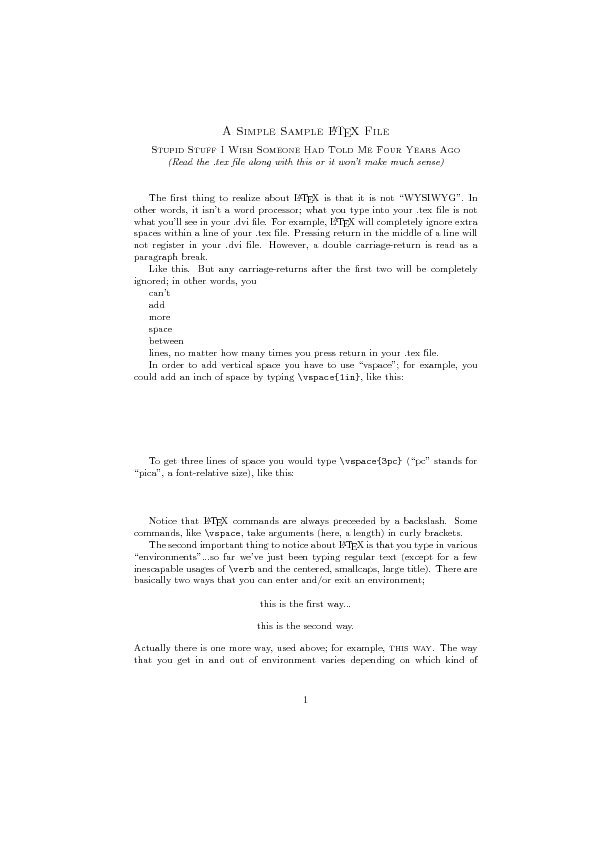
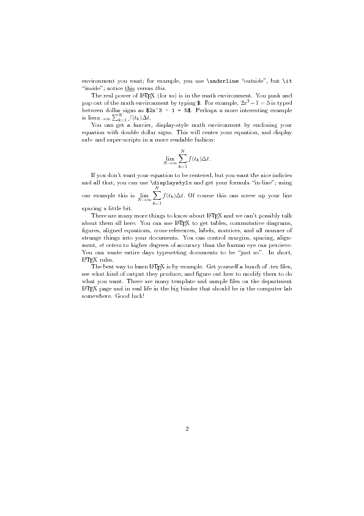

# Reproducible Research through LaTeX and Rmarkdown

이 저장소는 LaTeX와 R 마크다운을 사용하여 재현가능한 연구를 구현하고자 자료를 모으는 곳입니다.

## 예시

<https://services.math.duke.edu/computing/tex/templates.html>

``` r
tinytex::xelatex('intro.tex')
```

    ## [1] "intro.pdf"

``` r
system('convert intro.pdf intro.png')
```

 
