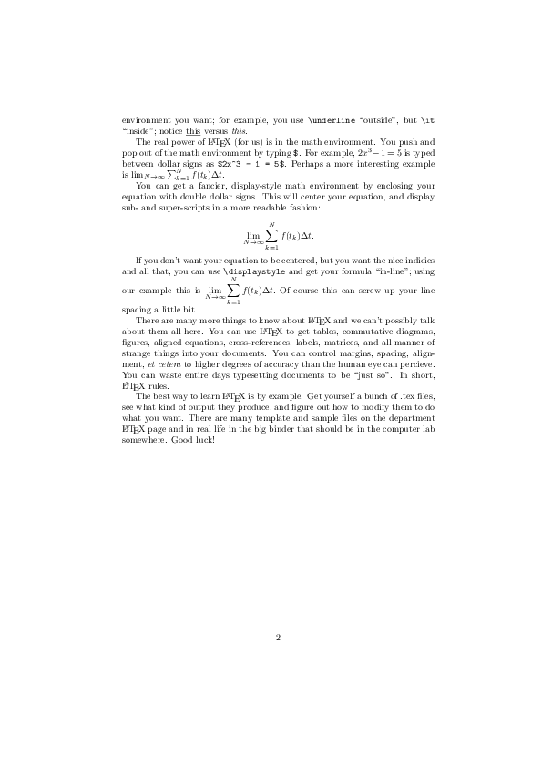

intro.tex
---------

<https://services.math.duke.edu/computing/tex/templates.html>

``` r
tinytex::xelatex('intro.tex')
system('convert intro.pdf intro.png')
```

    ## Warning: 명령 'convert intro.pdf intro.png'의 실행으로 상태 4가 되었습니다

 
